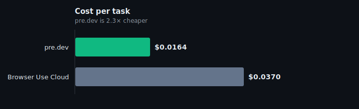
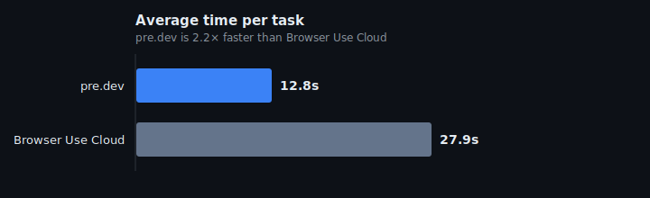

# browser-agents-benchmark

Reproducible head-to-head benchmark of browser-automation services across **100 real-world web tasks** — scraping, multi-step navigation, login flows, form fills, pagination.

> **pre.dev Browser Agents passes 100 / 100 tasks at ~12× lower cost than Browser Use Cloud.**

---

## Headline result

| Provider | Pass rate | Avg time / task | $ / task | Total $ for 100 tasks |
|---|---:|---:|---:|---:|
| **🏆 [pre.dev Browser Agents](https://pre.dev/browser-agents)** | **100 / 100** | **31.2 s** | **$0.0100** | **$1.00** |
| [Browser Use Cloud](https://cloud.browser-use.com) | 81 / 100 | 26.3 s | $0.1199 | $11.99 |

Same 100 tasks. Same JSON output schemas. Same uniform `successCheck` predicate. Browser agents are stochastic — individual runs on cheap-tier models vary by a few tasks per suite; the full per-task JSON + trace from this run is in `results/2026-04-17/` so the data can be re-scored independently.

### Cost per task



### Average time per task



**👉 [Full interactive report](https://pre.dev/benchmark.html)** — radar chart, leaderboard, per-task drilldown, raw JSON.

Also in this repo: [`results/2026-04-17/REPORT.md`](./results/2026-04-17/REPORT.md) · [`results/2026-04-17/report.html`](./results/2026-04-17/report.html) (raw HTML — open locally to view).

---

## Reproduce

```bash
git clone https://github.com/predotdev/browser-agents-benchmark
cd browser-agents-benchmark
bun install                  # or: npm install
cp .env.example .env         # then fill PREDEV_API_KEY + BROWSER_USE_API_KEY
bun run bench                # full 100-task suite, parallel, ~3-5 min
bun run report <runStamp>    # generate REPORT.md + report.html
```

API keys:
- **pre.dev** → https://pre.dev/projects/playground (suite runs ~$1 on an active Plus/Premium/Pro plan; free Trial only covers 1 task)
- **Browser Use Cloud** → https://cloud.browser-use.com/api-keys (suite runs ~$12; check their current free credit allotment)

### Narrow runs

```bash
tsx run.ts --config predev                 # one provider only
tsx run.ts --task 06-coingecko             # one task (prefix match)
tsx run.ts --limit 25 --parallel --concurrency 10
```

---

## Methodology

1. **100 tasks** in `tasks.json` — static scrapes, multi-page navigation, logins, form submissions, search → click → extract, dynamic JS pages, iframes, and CAPTCHA-protected sites.
2. **Same input contract for every provider**: `url`, `instruction`, optional `input` (form values), and `output` JSON Schema. pre.dev receives the schema via the `output` field on `/browser-agent`; browser-use receives it via the SDK's `outputSchema` option.
3. **One attempt per task per provider.** No adapter retries on empty output — the first run is the only run. (429 rate-limit backoff is allowed, since that's a throttling signal, not a task-level failure.)
4. **Uniform `successCheck`** predicate per task (`tasks.json`). It accepts any JSON shape containing the requested information — no provider's response format is privileged.
5. **Cost** is captured from each provider's response payload (or estimated at published rates). Wall time is measured by the harness.
6. **Per-task JSON** is written to `results/<runStamp>/<configId>/<taskName>.json`, a `summary.json` rolls them up, and `report.ts` generates a markdown + HTML report.

**Models used**
- pre.dev: `gemini-2.5-flash-lite` (the default low-cost tier on pre.dev Browser Agents)
- browser-use Cloud: `bu-mini` (the default low-cost tier on cloud.browser-use.com, backed by a Gemini Flash–class model at the time of this run)

Both are each provider's cheapest published tier. If you want to rerun against a different tier, pass it through the adapter config in `run.ts`.

Headline times are **mean** across all 100 tasks.

The numbers in this README come from `results/2026-04-17/`. That directory is committed so anyone can audit the raw data without re-running.

---

## Repo layout

```
browser-agents-benchmark/
├── README.md
├── .env.example
├── tasks.json                     # 100 benchmark tasks (self-contained)
├── tasks.ts                       # task loader + successCheck rehydration
├── types.ts
├── run.ts                         # bench runner
├── report.ts                      # markdown + HTML report generator
├── adapters/
│   ├── predev.ts
│   └── browser-use.ts
├── scripts/
│   └── generate-tasks.ts          # regenerate tasks.json from upstream
├── docs/
│   └── *.svg                      # charts embedded in this README
└── results/
    └── 2026-04-17/                # the run powering this README
        ├── summary.json
        ├── REPORT.md
        ├── report.html            # open in a browser for the interactive view
        ├── predev/<taskName>.json
        └── browser-use-cloud/<taskName>.json
```

---

## Adding your own competitor

Drop a file in `adapters/` implementing:

```ts
export async function runYours(task: BenchmarkTask, cfg: YourConfig): Promise<BenchmarkResult>;
```

Register it in `run.ts`'s `ALL_CONFIGS` array. The harness will run it against every task and fold the results into the report.

---

## License

MIT. Use this to validate any vendor's claims — including ours.
